```mermaid
mindmap
  root((Márcio Corrêa))
  ::icon(fa-solid fa-circle-user)
    Professional Profile
    ::icon(fa-solid fa-user-tie)
      QA Engineer
      ::icon(fa-solid fa-bug-slash)
      Test Automation Architect
      ::icon(fa-solid fa-robot)
      CTFL Certified
      ::icon(fa-solid fa-certificate)
    Core Skills
    ::icon(fa-solid fa-jedi)
      Automation
      ::icon(fa-solid fa-user-ninja)
        Appium
        ::icon(fa-solid fa-mobile-screen-button)
        Selenium/Cypress
        ::icon(fa-solid fa-window-maximize)
        API Testing
        ::icon(fa-solid fa-arrows-turn-to-dots)
      Programming
      ::icon(fa-solid fa-laptop-code)
        Kotlin
        ::icon(fa-solid fa-k)
        Java
        ::icon(fa-brands fa-java) 
        Python
        ::icon(fa-brands fa-python)
      DevOps
      ::icon(fa-brands fa-docker)
        CI/CD Pipelines
        ::icon(fa-solid fa-arrows-spin)
        Jenkins/GitHub Actions
        ::icon(fa-brands fa-jenkins)
    Expertise
    ::icon(fa-solid fa-brain)
      Financial Systems
      ::icon(fa-solid fa-landmark)
        Payments
        ::icon(fa-solid fa-money-bill)
        Open Banking
        ::icon(fa-solid fa-coins)
      Methodologies
      ::icon(fa-solid fa-book)
        Shift-Left
        ::icon(fa-regular fa-circle-left)
        Risk-Based Testing
        ::icon(fa-solid fa-circle-radiation)
    Differentiators
    ::icon(fa-solid fa-plus-minus)
      Mind Mapping
      ::icon(fa-regular fa-map)
      SDLC Integration
      ::icon(fa-solid fa-group-arrows-rotate)
      Mentoring
      ::icon(fa-solid fa-people-arrows)
```

### Hi there! I'm Márcio Corrêa 👋  

**Senior QA Engineer | Test Automation Specialist | Quality Advocate**  
*Building robust testing solutions for mission-critical systems*  

🔧 **Tech Stack**:  
`Appium`, `BackstopJS`, `BrowserStack`, `Cucumber`, `Cypress`, `DynamoDB`, `Docker`, `Git`, `GitLab`, `Jenkins`, `Jira`, `JMeter`, `JUnit`, `MongoDB`, `MySQL`, `NUnit`, `Oracle`, `Percy`, `PostgreSQL`, `Rest-Assured`, `RSpec`, `Selenium WebDriver`, `SoapUI`, `TestCafe`, `TestLink`, `XUnit`.

🧑‍💻 **Languages**:  
`C#` `Kotlin` `Java` `JavaScript` `Python` `Ruby`

🌱 **Currently Focused On**:  
- Automating financial/payment systems at PagBank  
- Integrating AI tools into test automation workflows  
- Mentoring junior QA engineers  

💡 **Passionate About**:  
- Shift-left testing strategies  
- Visualizing tests with **mind maps**  
- CI/CD pipeline optimization  

📌 **Websites Developed**:  
- https://pedeamoramarilia.com.br
- https://fplanconsultoria.com.br

📫 **Let's Connect**:  

   
  
  
  

---

---

  
   
  

---

<!-- Contador de Visitantes -->

   
<b>Visitor count</b>
  
  

 
   

